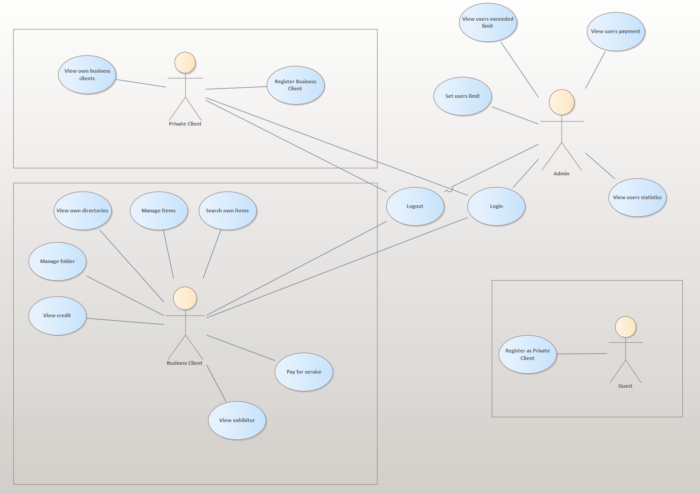
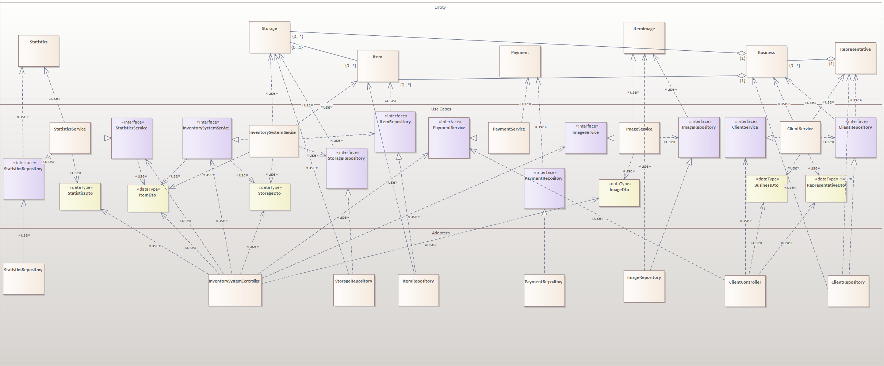

# Inventory backend (v2)

## Preface

Decisions, especially those related to architecture were made by me in order to explore new possibilities in development. These solutions may not be optimal for such a small task.  Basically, my inspiration was the book "Clean Architecture" by Robert Martin
This is already second version of this project. You can find first version in my GitHub.

## Introduction

This project was developed for NetGroup Estonia in 2023 year. 
This is a multi-module application that implements the ability to create an inventory as a business user as well as to create business users as a representative. 
This application also includes a payment functionality, statistics for the user's items and the ability to upload pictures for the user's items. All changes can only be made by the business user himself

### Technologies
* Spring
* Hibernate JPA
* Maven
* PostgreSQL
* Liquibase Migration

## Architecture





This architecture consists of three layers (entity, use case, adapter (divided into ui and infrastructure)). Entity layer is a POJO class that implements critical application data. 
The use case layer represents the business logic of the application.
The adapter layer mediates between different forms of data and acts as a translator, which translates the data into a form understandable to the use case.

All dependencies are directed upwards, each higher layer knows nothing about the lower ones, and the more upwards the more stable and important the layer.

## End points
Endpoints via Swagger - UI: ```http://{server}:{port}/api/swagger-ui/index.html#/```

<details>
 <summary><code>POST</code> <code><b>/business/registration</b></code> <code>Registrates a new business</code></summary>

##### Parameters

| name           | type     | data type     | description                                                       |
|----------------|----------|---------------|-------------------------------------------------------------------|
| body           | required | object (JSON) | <details>```{"name": "string", "password": "string"}```</details> |

##### Responses

| http code | content-type       | response                                 |
|-----------|--------------------|------------------------------------------|
| `201`     | `application/json` | `Business has been created successfully` |                                                              |
</details>

<details>
 <summary><code>POST</code> <code><b>/user/registration</b></code> <code>Registrate a new user</code></summary>

##### Parameters

| name           | type     | data type     | description                                                       |
|----------------|----------|---------------|-------------------------------------------------------------------|
| body           | required | object (JSON) | <details>```{"name": "string", "password": "string"}```</details> |

##### Responses

| http code | content-type       | response                             |
|-----------|--------------------|--------------------------------------|
| `201`     | `application/json` | `User has been created successfully` |                                                              |
</details>

<details>
 <summary><code>GET</code> <code><b>/business/storage</b></code> <code>Get storage's content</code></summary>

##### Parameters

| name      | type         | data type | description |
|-----------|--------------|-----------|-------------|
| storageId | non-required | int       |             |

##### Responses

| http code | content-type       | response                              |
|-----------|--------------------|---------------------------------------|
| `200`     | `application/json` | `Storage's content has been provided` |                                                              |
</details>

<details>
 <summary><code>POST</code> <code><b>/business/storage</b></code> <code>Create a new storage</code></summary>

##### Parameters

| name           | type     | data type     | description                                                             |
|----------------|----------|---------------|-------------------------------------------------------------------------|
| body           | required | object (JSON) | <details>```{"name": "string", "upperStorageId": "number"}```</details> |

##### Responses

| http code | content-type       | response                                |
|-----------|--------------------|-----------------------------------------|
| `200`     | `application/json` | `Storage has been created successfully` |                                                              |
</details>

<details>
 <summary><code>POST</code> <code><b>/business/item</b></code> <code>Create a new item</code></summary>

##### Parameters

| name           | type     | data type     | description                                                        |
|----------------|----------|---------------|--------------------------------------------------------------------|
| body           | required | object (JSON) | <details>```{"name": "string", "storageId": "number"}```</details> |

##### Responses

| http code | content-type       | response                                |
|-----------|--------------------|-----------------------------------------|
| `200`     | `application/json` | `Storage has been created successfully` |                                                              |
</details>

<details>
 <summary><code>GET</code> <code><b>/business/search</b></code> <code>Search content by name</code></summary>

##### Parameters

| name | type     | data type | description |
|------|----------|-----------|-------------|
| name | required | string    |             |

##### Responses

| http code | content-type       | response                            |
|-----------|--------------------|-------------------------------------|
| `200`     | `application/json` | `Content has been created provided` |                                                              |
</details>

<details>
 <summary><code>DELETE</code> <code><b>/business/item/{id}</b></code> <code>Delete item by id</code></summary>

##### Parameters

| name | type     | data type | description |
|------|----------|-----------|-------------|
| id   | required | number    |             |

##### Responses

| http code | content-type       | response                |
|-----------|--------------------|-------------------------|
| `200`     | `application/json` | `Item has been deleted` |                                                              |
</details>

<details>
 <summary><code>DELETE</code> <code><b>/business/storage/{id}</b></code> <code>Delete storage by id</code></summary>

##### Parameters

| name | type     | data type | description |
|------|----------|-----------|-------------|
| id   | required | number    |             |

##### Responses

| http code | content-type       | response                   |
|-----------|--------------------|----------------------------|
| `200`     | `application/json` | `Storage has been deleted` |                                                              |
</details>

<details>
 <summary><code>POST</code> <code><b>/business/upload/image</b></code> <code>Upload image for item</code></summary>

##### Parameters

| name  | type     | data type | description |
|-------|----------|-----------|-------------|
| files | required | file      |             |

##### Responses

| http code | content-type       | response   |
|-----------|--------------------|------------|
| `200`     | `application/json` | `Uploaded` |                                                              |
</details>

<details>
 <summary><code>GET</code> <code><b>/business/load/image/{id}</b></code> <code>Load image by item id</code></summary>

##### Parameters

| name | type     | data type | description |
|------|----------|-----------|-------------|
| id   | required | file      |             |

##### Responses

| http code | content-type       | response         |
|-----------|--------------------|------------------|
| `200`     | `application/json` | `Image as bytes` |                                                              |
</details>


